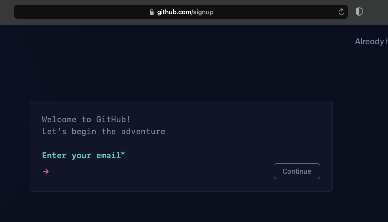

# Cheap & FAIR Tutorial at Gateways 2024

[See the homepage of the organization](https://github.com/cheapandfair) for more details about the Cheap & FAIR Data Portal.

The tutorial at Gateways 2024 is scheduled for September 30th, 2024.

## Gateways 2024 Tutorial Setup

- [GitHub Account](#GitHub-Account)
- [Globus Account](#Globus-Account)
- [Join ourGlobus Group](#Join-our-Globus-Group)

---

### GitHub Account

- Create a <a target="_blank" href="https://github.com">GitHub</a> account if you don't already have one. You can also create one just for this tutorial.
- <a target="_blank" href="https://github.com/signup">GitHub sign up link</a>

Links:

- <a target="_blank" href="https://github.com/">https://github.com/</a>
- <a target="_blank" href="https://github.com/signup">https://github.com/signup</a>

---

### Globus Account

- If you already have a <a target="_blank" href="https://www.globus.org/">Globus</a> account, <a target="_blank" href="https://docs.globus.org/guides/tutorials/manage-identities/link-to-existing/">link your GitHub identity</a>.
- If you're new to Globus, <a target="_blank" href="https://app.globus.org/">login to Globus</a> and select GitHub on the login page.

Links:

- <a target="_blank" href="https://www.globus.org/">https://www.globus.org/</a>
- <a target="_blank" href="https://docs.globus.org/guides/tutorials/manage-identities/link-to-existing/">https://docs.globus.org/guides/tutorials/manage-identities/link-to-existing/</a>
- <a target="_blank" href="https://app.globus.org/">https://app.globus.org/</a>

---

### Join our Globus Group

- After you have logged in to Globus, request to join the <a target="_blank" href="https://app.globus.org/groups/fad784e0-67dd-11ef-87ff-09715fb135c2/join">Cheap and FAIR Tutorial Users</a> Globus Group.
- This will allow you to access the JupyterHub server used during the tutorial and we'll use it to provision your Globus Guest Collection.
- If you have multiple identities in your account, select your GitHub identity. If needed, enter your name and organization, and acknowledge the example Terms and Conditions.
- After you request to join the Group it will be approved by the instructors.

Links:

- <a target="_blank" href="https://app.globus.org/groups/fad784e0-67dd-11ef-87ff-09715fb135c2/join">https://app.globus.org/groups/fad784e0-67dd-11ef-87ff-09715fb135c2/join</a>
