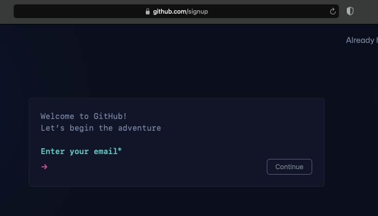
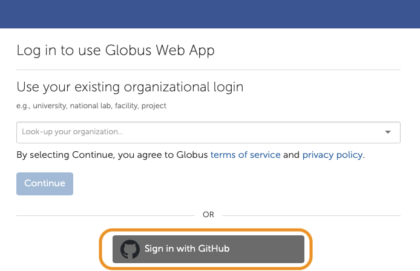
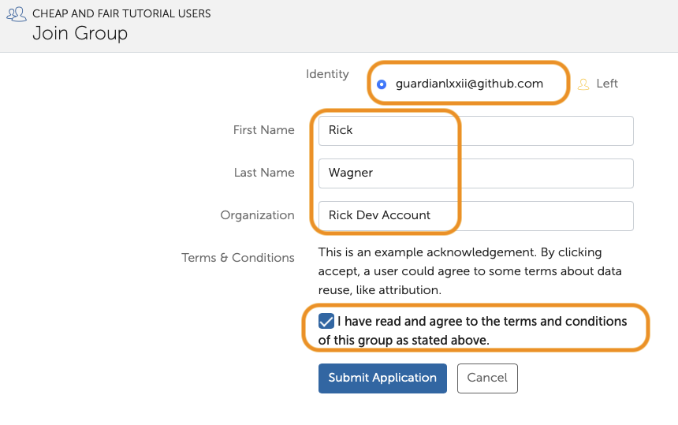

# Cheap and FAIR: Building a Serverless Research Data Repository

## Gateways 2024 Tutorial Setup

- [GitHub Account](#GitHub-Account)
- [Globus Account](#Globus-Account)
- [Join ourGlobus Group](#Join-our-Globus-Group)

---

## GitHub Account

- Create a [GitHub](https://github.com) account if you don't already have one. You can also create one just for this tutorial.
- [GitHub sign up link](https://github.com/signup)

Links:

- https://github.com/
- https://github.com/signup

---

## Globus Account

- If you already have a [Globus](https://wwww.globus.org/) account, [link your GitHub identity](https://docs.globus.org/guides/tutorials/manage-identities/link-to-existing/).
- If you're new to Globus, [login to Globus](https://app.globus.org/) and select GitHub on the Globus login page.

Links:

- https://www.globus.org/
- https://docs.globus.org/guides/tutorials/manage-identities/link-to-existing/
- https://app.globus.org/

---

## Join our Globus Group

- After you have logged in to Globus, request to join the [Cheap and FAIR Tutorial Users](https://app.globus.org/groups/fad784e0-67dd-11ef-87ff-09715fb135c2/join) Globus Group.
- This will allow you to access the JupyterHub server used during the tutorial and we'll use it to provision your Globus Guest Collection.
- If you have multiple identities in your account, select your GitHub identity. If needed, enter your name and organization, and acknowledge the example Terms and Conditions.
- After you request to join the Group it will be approved by the instructors.

Links:

- https://app.globus.org/groups/fad784e0-67dd-11ef-87ff-09715fb135c2/join